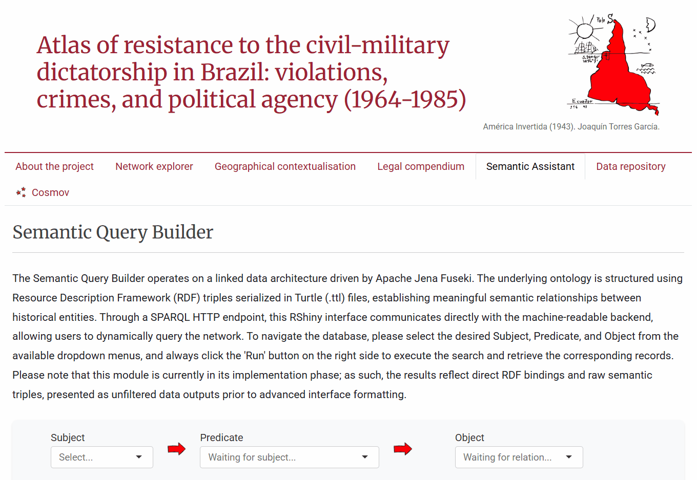

# Atlas of resistance to the civil-military dictatorship in Brazil: violations, crimes, and political agency (1964-1985)
 

A knowledge‑graph platform for archival research on labour resistance, legal categories, and transitional justice.

---

## Overview
This repository contains the data modelling, query framework, and demonstration datasets developed for the doctoral research project **Educational initiatives of the Metallurgical Trade Union Opposition in São Paulo**, supported by FAPESP (grant **25/11544‑9**). The project builds a structured digital corpus to support historical research into state violence, legal classifications of crimes and human‑rights violations, and processes of memory and reparation across Latin American dictatorships.

---
**Project Demonstration**

**General Overview**


**Semantic Query Builder**


## What this project does
- **Structures archival material as a knowledge graph** to capture relationships between people, unions, events, and legal instruments.  
- **Implements SPARQL queries and examples** to extract historical patterns and legal category evolution.  
- **Provides interactive visualisations** using R and Shiny that connect graph data to transcripts, documents, and geographic context.  
- **Preserves a neutral, humanistic archival approach** to support memory, truth, and reparative justice without exposing unpublished research data.

---

## Technical framework
**Core components**
- **Ontology and data modelling**: bespoke schema to represent actors, institutions, events, and legal classifications.  
- **Query layer**: SPARQL examples and templates for reproducible extraction of research‑relevant subgraphs.  
- **Analysis and UI**: R scripts and Shiny apps for processing query results and producing interactive interfaces.  
- **Data handling**: curated structural samples included to demonstrate architecture and workflows while protecting sensitive or unpublished material.

**Languages and tools**
- RDF / OWL for ontology design  
- SPARQL for querying  
- R and Shiny for data processing and web interfaces  
- Git and GitHub for versioning and collaboration

---


## Getting started
1. **Clone the repository**
```bash
git clone https://github.com/mmillenaa/atlas-of-resistance.git
cd your-repo

